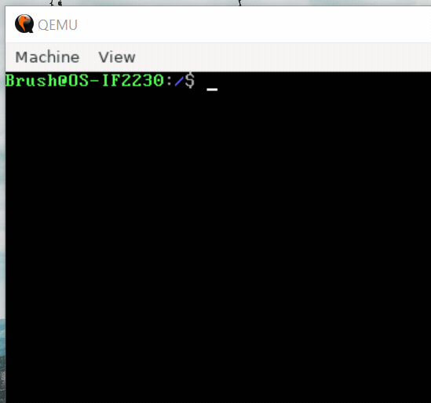

# OS-2023
Testing spesifikasi IF2230 Sistem Operasi 2023

Karena ada sedikit masalah dengan directory name length dengan manim (temporary file biasanya relatif panjang filenamenya), untuk source code animasi manim dipindah ke separate repository:

https://github.com/Lock1/OS-2023-Manim

[Dev Repository untuk kit](https://github.com/Lock1/kit-OS-2023)

## Coding convention
- Yes, i have problem with my kind-of-insane-verbosity, but i like it anyway
- Global variable use `_<filename>_<variable name>`
- Assembly filename: `<filename>-asm.s`, with `filename` is same with C counterpart (ex. `interrupt.c` and `interrupt-asm.s`)
- Both `<filename>-asm.s` and `<filename>.c` will use single header `<filename>.h`
- Special exception for `kernel.c` and `kernel-entrypoint.s`, with single header `kernel.h`

## Planned Roadmap
### Milestone 1
1-5
Notes - [Milestone 1 Notes](/other/notes/Milestone%201%20Notes.md)
- [x] Initial setup & toolchain install
- [x] Bootloader
- [x] I/O Memory Map (VGA)
- [x] Global Descriptor Table (GDT) + Protected Mode
- [x] Initial kit / template milestone 1

### Milestone 2
6-11
- [x] Interrupt (IRQ kaya keyboard)
- [x] Filesystem
- [-] ~~Basic process + monotasking~~ Dropped for milestone 2

### Milestone 3
12-End
- [x] Paging
- [x] User mode
- [x] Basic shell

### Dropped
Seems too hard?
- [-] ~~Memory management (memcpy, malloc, etc)~~
- [-] ~~Multitasking~~

## Resources
32 bit Resources

- Bootloader & GRUB : http://www.jamesmolloy.co.uk/tutorial_html/index.html + https://littleosbook.github.io/

Possibly main resource : https://littleosbook.github.io/
- https://539kernel.com/
- https://github.com/tuhdo/os01
- https://github.com/HazemGabr232/Simple_OS
- http://www.cs.bham.ac.uk/~exr/lectures/opsys/10_11/lectures/os-dev.pdf
- https://wiki.osdev.org/Expanded_Main_Page
- https://github.com/cfenollosa/os-tutorial
